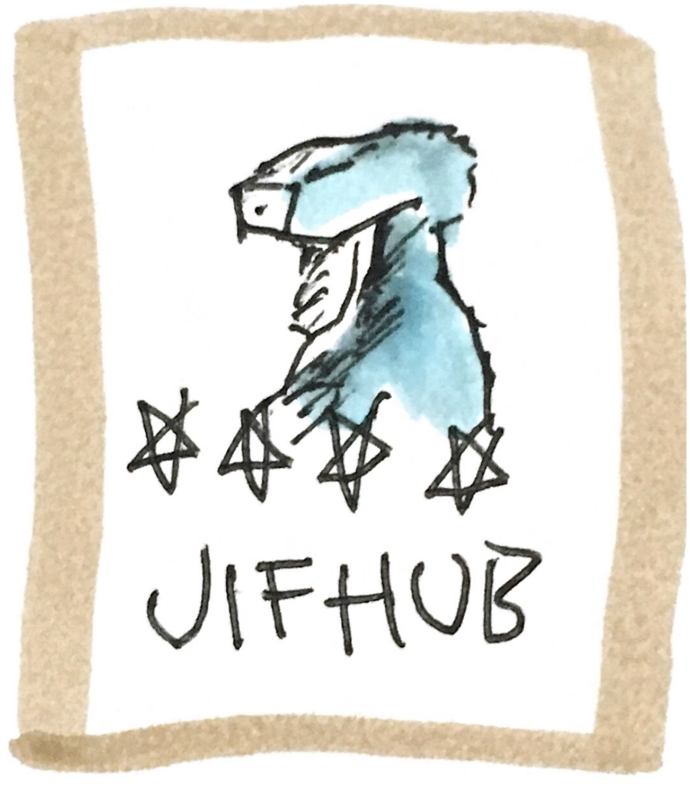

# JIFHUB

This project aims to unify all hardware and iot projects going on in @larskarbo's head.

To keep it nice and clean, all projects should be in a different folder, all with a seperate `README.md` that details what the project is for.

Try to keep all code documented and DRY. Make shared folders with modules if needed

